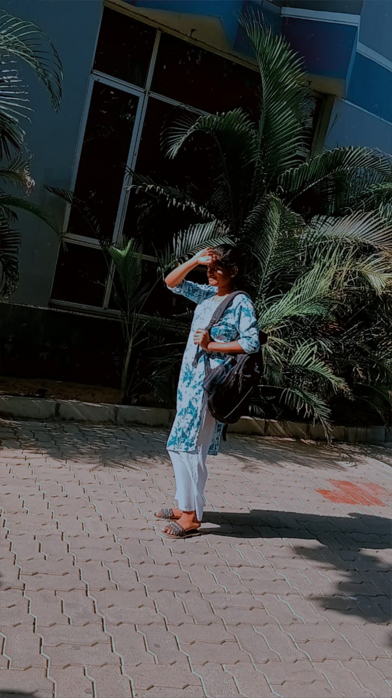

# Ex.08 Design of Interactive Image Gallery
## Date:08/10/2025

## AIM:
To design a web application for an inteactive image gallery with minimum five images.

## DESIGN STEPS:

### Step 1:
Clone the github repository and create Django admin interface.

### Step 2:
Change settings.py file to allow request from all hosts.

### Step 3:
Use CSS for positioning and styling.

### Step 4:
Write JavaScript program for implementing interactivity.

### Step 5:
Validate the HTML and CSS code.

### Step 6:
Publish the website in the given URL.

## PROGRAM :
```
gallery.html
<html>
    <head>
        <title>Gallery</title>
        <link rel="stylesheet" href="style1.css">
        <script src="style2.js"></script>
    </head>
    <body>
        <h1>MY GALLERY - dsanjtha(25015927))</h1>
        <div class="gallery">
            <div class="galleryitem">
                
            </div>
            <div class="galleryitem">
                
            </div>
            <div class="galleryitem">
                
            </div>
            <div class="galleryitem">
                
            </div>
            <div class="galleryitem">
                
            </div>
        </div>
    </body>
</html>

style1.css
body {
    background-color: pink;
    text-align: center;
    margin-top: 50px;
}

.gallery {
    display: flex;
    gap: 20px;
    padding-top: 50px;
    justify-content: center;;
}

.galleryitem {
    cursor: pointer;
    text-align: center;
    width: 200px;
    padding: 20px;
}

.galleryitem img {
    width: 230px;
    height: 300px;
}
style2.css
function mousein()
{
    document.getElementById("Photo").style.width="250";
    document.getElementById("Photo").style.height="350";
}

function mouseout()
{
    document.getElementById("Photo").style.width="230";
    document.getElementById("Photo").style.height="300";
}
```
## OUTPUT:
.png>)

## RESULT:
The program for designing an interactive image gallery using HTML, CSS and JavaScript is executed successfully.
